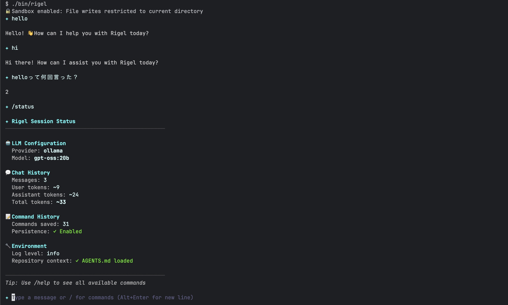

# Rigel - AI Coding Agent

A Go-based AI coding assistant that helps developers write, review, and improve code through natural language interactions.



## Features

- AI-powered coding assistant
- Multiple LLM providers (Anthropic, Ollama)
- Clean terminal-based chat interface
- Sandbox support for safe code execution

## Requirements

- Go 1.25 or higher
- Git

## Installation

```bash
# Clone the repository
git clone https://github.com/mizzy/rigel.git
cd rigel

# Download dependencies
go mod download

# Build
go build -o rigel cmd/rigel/main.go

# Install (optional)
go install ./cmd/rigel

# Set up environment variables
cp .env.example .env
# Edit .env with your API keys
```

## Configuration

By default, Rigel uses Ollama with the `gpt-oss:20b` model. No API keys are required for the default configuration.

### Default Configuration (Ollama)

The application works out of the box with Ollama running locally:
- Provider: `ollama`
- Model: `gpt-oss:20b`
- Base URL: `http://localhost:11434`

Make sure Ollama is installed and running locally:
```bash
# Install Ollama (if not already installed)
curl -fsSL https://ollama.com/install.sh | sh

# Pull the default model
ollama pull gpt-oss:20b

# Start Ollama server (if not already running)
ollama serve
```

### Custom Configuration

Create a `.env` file to use different providers or models:

```bash
# Choose a provider: ollama, anthropic
PROVIDER=anthropic

# AI Model API Keys (required based on provider)
ANTHROPIC_API_KEY=your_anthropic_api_key
# OPENAI_API_KEY=your_openai_api_key        # Coming soon
# GOOGLE_API_KEY=your_google_api_key        # Coming soon
# AZURE_OPENAI_API_KEY=your_azure_api_key   # Coming soon

# Custom model (optional, defaults based on provider)
MODEL=claude-3-5-sonnet-20241022

# Ollama configuration (when using Ollama)
OLLAMA_BASE_URL=http://localhost:11434

# Logging
RIGEL_LOG_LEVEL=info
```

## Usage

### Interactive Chat Mode

Rigel features a clean and simple chat interface for AI-assisted coding:

```bash
# Start Rigel
rigel
```

#### Commands

| Command | Action |
|-----------------|--------|
| `/init` | Analyze repository and generate AGENTS.md |
| `/model` | Show current model and select from available models |
| `/provider` | Switch between LLM providers (Anthropic, Ollama, etc.) |
| `/status` | Show current session status and configuration |
| `/help` | Show available commands |
| `/clear` | Clear chat history |
| `/clearhistory` | Clear command history |
| `/exit` or `/quit` | Exit the application |

#### Keyboard Shortcuts

| Shortcut | Action |
|----------|--------|
| `Enter` | Send message |
| `Alt+Enter` | New line |
| `Tab` | Complete command |
| `↑/↓` | Navigate suggestions |
| `Ctrl+C` (twice) | Exit |

#### Example Session

```
✦ /init

✅ Repository analyzed successfully! AGENTS.md has been created.

The file contains:
• Repository structure and overview
• Key components and their responsibilities
• File purposes and dependencies
• Testing and configuration information

✦ How do I read a file in Go?

To read a file in Go, you have several options. Here's the most common approach:

```go
import (
    "os"
    "io"
)

func readFile(path string) ([]byte, error) {
    return os.ReadFile(path)
}
```

✦ █ Type a message or / for commands (Alt+Enter for new line)
```

### Non-Interactive Mode

You can also use Rigel with pipes and scripts:

```bash
# Pipe input
echo "Write a hello world in Python" | rigel

# Use with heredocs
rigel << EOF
Explain this code:
$(cat main.go)
EOF

# Read from file
cat prompt.txt | rigel
```

## Architecture

```
rigel/
├── cmd/
│   └── rigel/         # CLI entry point
├── internal/
│   ├── agent/         # AI agent functionality
│   ├── analyzer/      # Repository analysis
│   ├── config/        # Configuration management
│   ├── history/       # Command history management
│   ├── llm/           # LLM provider integrations
│   │   ├── anthropic.go  # Anthropic Claude integration
│   │   └── ollama.go     # Ollama local models
│   ├── sandbox/       # Sandbox for safe code execution
│   ├── tools/         # Tool integrations
│   ├── tui/           # Terminal UI components
│   │   ├── chat.go       # Main chat model
│   │   ├── commands.go   # Command handling
│   │   ├── suggestions.go # Autocomplete logic
│   │   └── styles.go     # Color scheme
│   └── version/       # Version information
```

## Development

### Setup Pre-commit Hooks

```bash
# Install pre-commit (if not already installed)
# macOS
brew install pre-commit

# Linux/Windows (via pip)
pip install pre-commit

# Install git hooks
pre-commit install

# Run hooks manually on all files
pre-commit run --all-files
```

### Development Commands

```bash
# Run in development mode
go run cmd/rigel/main.go

# Run tests
go test ./...

# Test coverage
go test -cover ./...

# Benchmark tests
go test -bench=. ./...

# Static analysis
staticcheck ./...

# Build
make build
```

## Supported LLM Providers

### Currently Supported
- **Anthropic** (Claude models) - Full support
- **Ollama** (Local models) - Full support

### Planned
- **OpenAI** (GPT models) - Coming soon
- **Google** (Gemini models) - Coming soon
- **Azure OpenAI** - Coming soon

## Contributing

1. Fork the repository
2. Create your feature branch (`git checkout -b feature/amazing-feature`)
3. Commit your changes (`git commit -m 'Add some amazing feature'`)
4. Push to the branch (`git push origin feature/amazing-feature`)
5. Open a Pull Request

## License

MIT License - see [LICENSE](LICENSE) file for details
